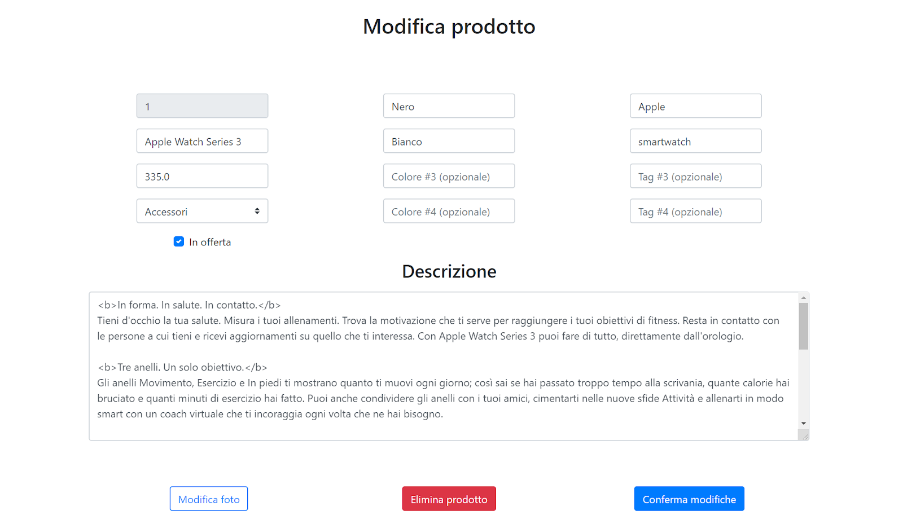
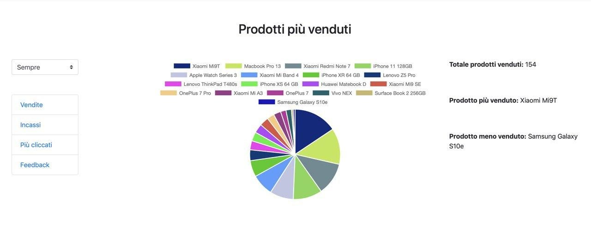
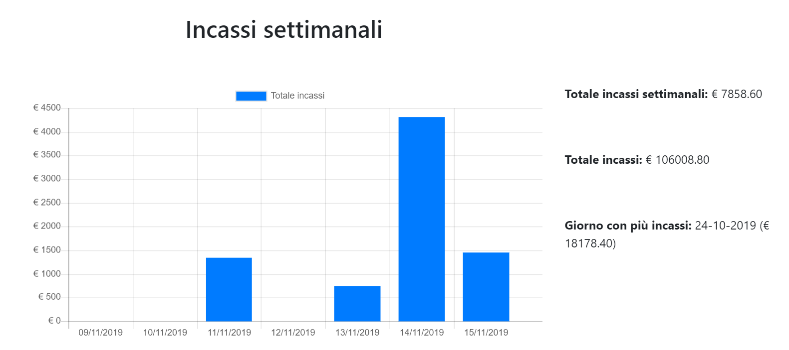
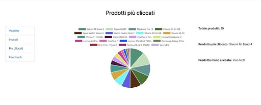
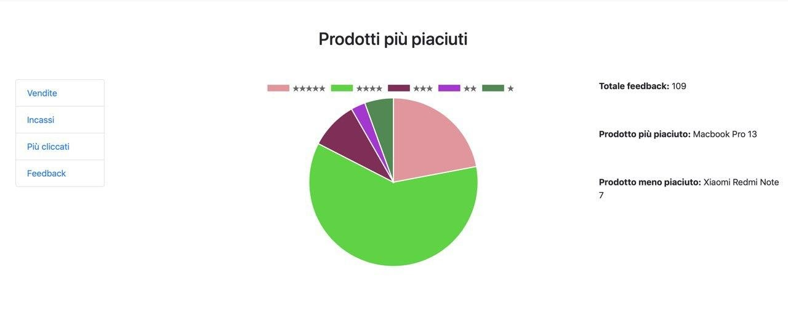

# EC-18 WEBSITE
E' un sistema informativo finalizzato a una gestione di una moderna piattaforma e-commerce multicanale.
### Il sistema presenta due parti:
- Back-End
- Front-End
### Principali tecnologie utilizzate:
- AWS
- PostgreSQL
- Apache Tomcat 

L'e-commerce è definito come l’insieme delle transazioni commerciali effettuate via Internet.
Esistono vari tipi di e-commerce come ad esempio:
- B2C (business to consumer)
- B2B (business to business)
- C2C (consumer to consumer)

Viene definito multicanale perché la vendita dei prodotti può avvenire tramite sito web e applicazione mobile.

# Back-End

Questa parte del sistema è usata dall’amministratore per la gestione degli articoli. L’amministratore ha la possibilità di effettuare le tipiche operazioni CRUD sulla base di dati.

Inoltre, l’amministratore ha la possibilità di:
- Modificare o aggiungere un prodotto

- Visualizzazione statistiche
  - Vendite
    
  - Incassi
    
  - Più cliccati
      
  - Feedback
    
  
# Front-End

Questa parte del sistema è usata da un utente per effettuare tutte le operazioni utili per l’ acquisto o alla ricerca di uno o più prodotti all’interno del sito web oppure dell’applicazione mobile.

Le operazioni effettuate dall’utente sono:
- Login/Registrazione
- Ricercare un prodotto tramite filtri avanzati
- Visualizzare i dettagli dei prodotti
- Acquistare dei prodotti con gestione del carrello e dei pagamenti
- Rilasciare una valutazione sui prodotti acquistati 
- Visualizzare e modificare i dati utente

# Tecnologie

In questa sezione verranno elencate ed analizzate alcune delle tecnologie utilizzate per lo sviluppo dell’e-commerce.

- ##### AWS
  Amazon Web Services è una piattaforma che offre una vasta gamma di servizi cloud-based,       come ad esempio elaborazione, storage, database, reti, analisi, machine learning, intelligenza artificiale, Internet of Things, sicurezza e sviluppo di applicazioni, distribuzione e gestione. Questa grande selezione di servizi e funzionalità rendono più semplice, veloce ed economica la migrazione di app esistenti al cloud e permettono la progettazione di qualsiasi cosa.
  
  Servizi:
    - Cognito
    - EC2
    - Elastic Beanstalk
    - RDS
    - S3
    
- ##### PostgreSQL

  PostgreSQL è un completo DBMS ad oggetti rilasciato con licenza libera. PostgreSQL usa il linguaggio SQL per eseguire delle query sui dati. Questi sono conservati come una serie di tabelle con chiavi esterne che servono a collegare i dati correlati.

- ##### Apache Tomcat

  Apache Tomcat è un web server open source che implementa le specifiche JavaServerPages (JSP) e servlet, fornendo quindi una piattaforma software per l'esecuzione di applicazioni Web sviluppate in linguaggio Java. La sua distribuzione standard include anche le funzionalità di web server tradizionale.

## Developers
- rxlele
- MarcoVitiello
- lucamadd
